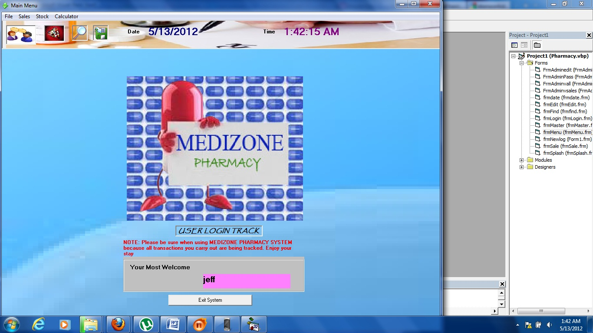



## PHARMACY\_SYSTEM

### Description

This code manages drug inventory, sales, and checks for stock levels on specific drugs.

I built this code as my course work assignment.

For any comments and improvement on my code, email me <kimbsan.sande@gmail.com>

or <skimbowa@nkumbauni.ac.ug>
 
### More Info
 

             |
---                |---
**Submitted On**   |2012-05-13 01:41:40
**By**             |[KIMBOWA SANDE JEFF](https://github.com/Planet-Source-Code/PSCIndex/blob/master/ByAuthor/kimbowa-sande-jeff.md)
**Level**          |Intermediate
**User Rating**    |5.0 (10 globes from 2 users)
**Compatibility**  |VB 6\.0
**Category**       |[Databases/ Data Access/ DAO/ ADO](https://github.com/Planet-Source-Code/PSCIndex/blob/master/ByCategory/databases-data-access-dao-ado__1-6.md)
**World**          |[Visual Basic](https://github.com/Planet-Source-Code/PSCIndex/blob/master/ByWorld/visual-basic.md)
**Archive File**   |[PHARMACY\_S2223925132012\.zip](https://github.com/Planet-Source-Code/kimbowa-sande-jeff-pharmacy-system__1-74359/archive/master.zip)

